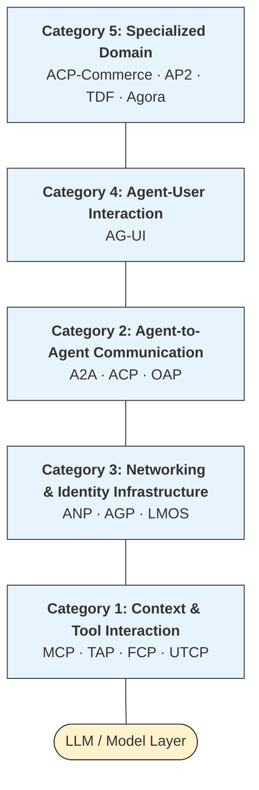
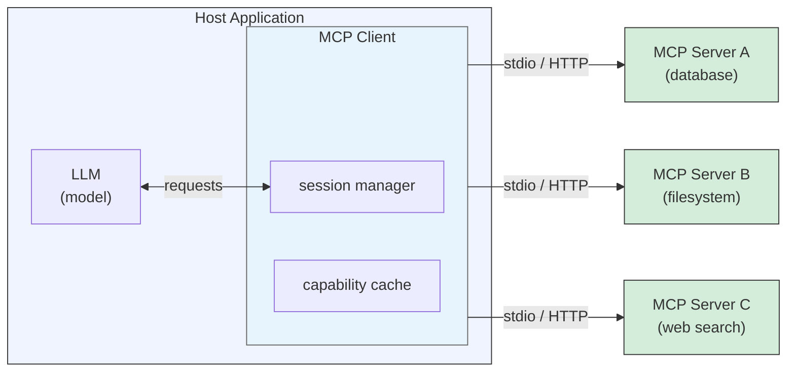
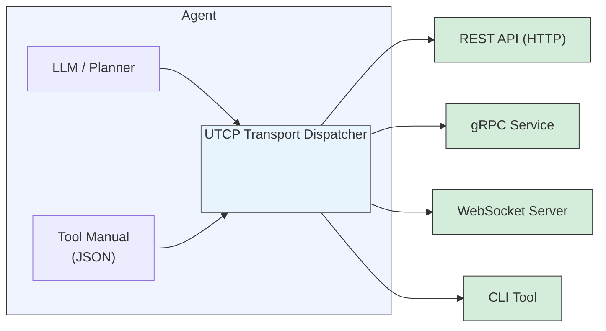
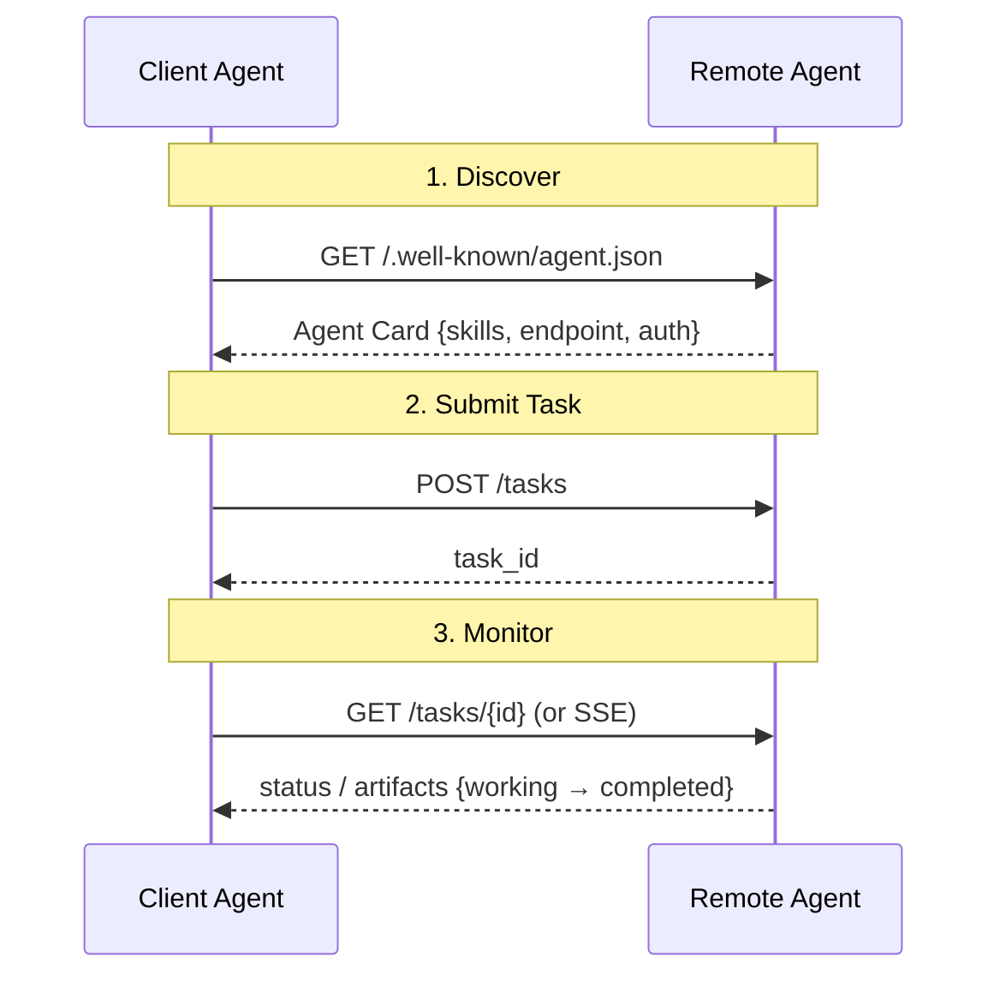
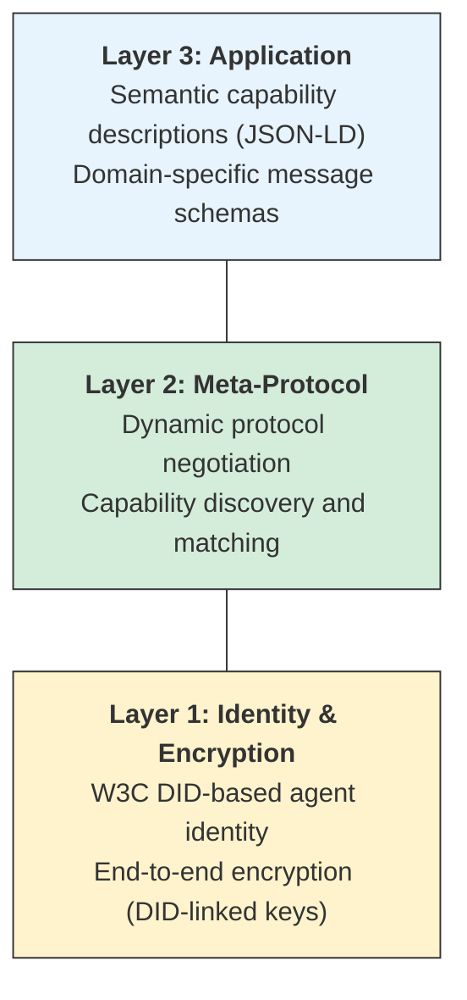
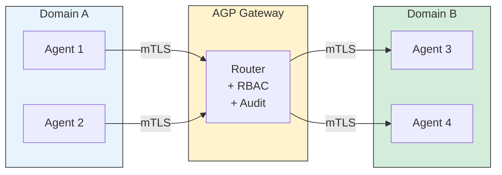
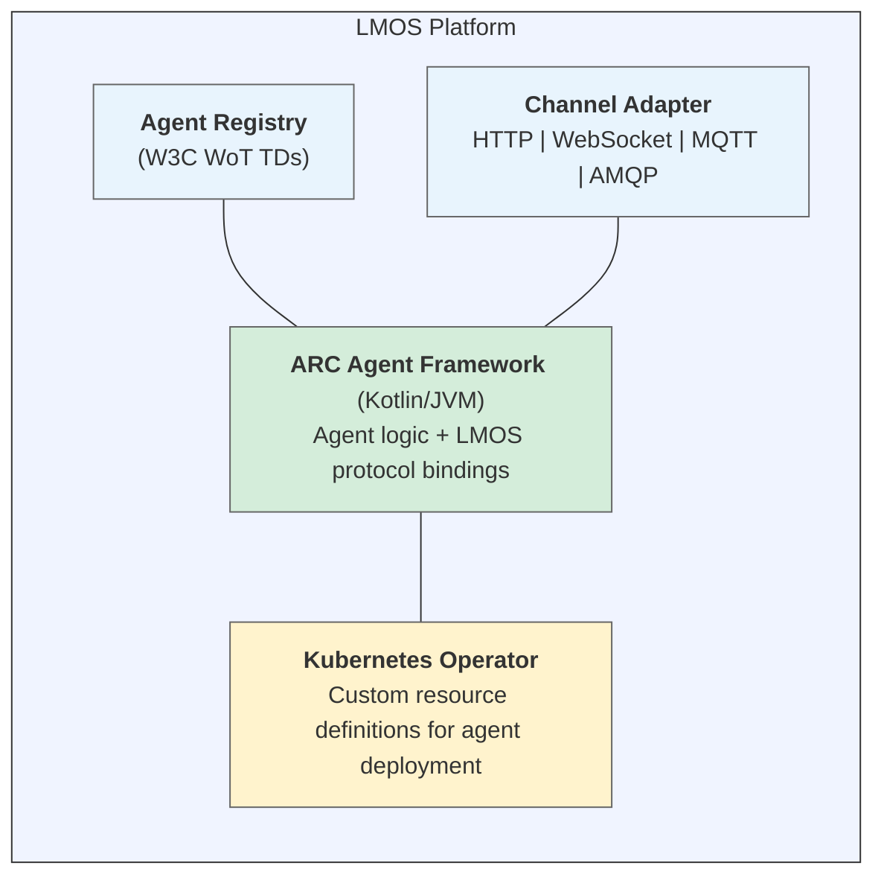
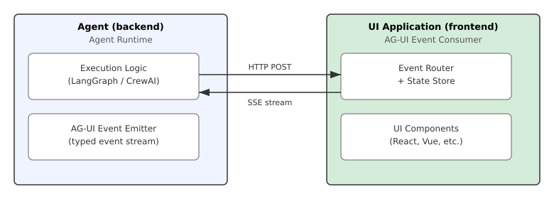
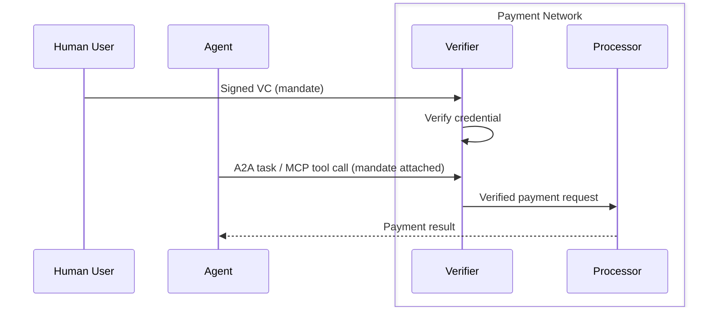
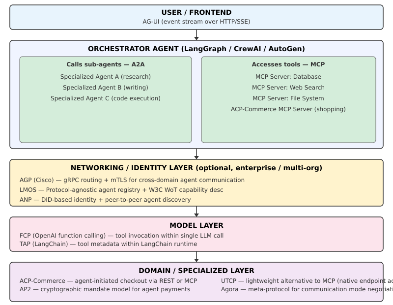

\newpage
# Introduction

The emergence of autonomous AI agents capable of using tools, coordinating with other agents,
and interacting with users across complex workflows has created an urgent need for interoperability
standards. Without shared protocols, each framework invents its own wire format, capability
discovery mechanism, and authentication model — resulting in fragmented ecosystems where agents
built on different platforms cannot communicate, and developers face vendor lock-in at every layer.

This survey documents the protocols that have emerged to address these challenges across five
functional layers of the agentic stack. The landscape is evolving rapidly: several protocols
launched in 2025, governance has shifted (multiple projects donating to the Linux Foundation),
and consolidation is already underway (IBM's ACP merging into Google's A2A in December 2025).

## Why Protocols Matter

Protocols in the agentic context serve three purposes:

1. **Interoperability** — Agents built with different frameworks (LangGraph, AutoGen, CrewAI)
   can exchange tasks, capabilities, and results without custom adapters.
2. **Composability** — A well-defined protocol boundary allows agents to be composed into
   pipelines without each component needing to understand the internals of others.
3. **Governance and trust** — Standardized authentication, identity, and authorization patterns
   reduce the attack surface of multi-agent systems and enable auditable agent behavior.

## How the Layers Relate

The five categories in this survey correspond to distinct concerns in the agentic stack:

**Category 1** sits closest to the model: it defines how agents discover and invoke tools and
external data sources.

**Category 2** governs how agents coordinate with each other.

**Category 3** provides the networking fabric: routing, identity, and discovery ; on which agent networks
run.

**Category 4** connects agents to human users.

**Category 5** covers domain-specific extensions
for commerce, payments, and academic research into agent meta-protocols.

Understanding which layer a protocol operates on is essential for avoiding category errors ; 
for instance, MCP and A2A are frequently compared but address entirely different problems;
they are complementary, not competing.

\newpage
# Category 1: Context and Tool Interaction

Protocols in this category define how an agent accesses external tools, APIs, data sources,
and computational resources. They solve the problem of capability extension: an LLM on its
own cannot browse the web, query a database, or call a REST API — tool interaction protocols
define the interface through which these capabilities are exposed and invoked.

## MCP (Model Context Protocol)^1^

| Field | Details |
|---|---|
| **Developer/Origin** | Anthropic (donated to Linux Foundation, Dec 2025)^2^ |
| **Released** | November 2024 |
| **Governance** | Linux Foundation (Anthropic retaining specification stewardship)^3^ |
| **Current Status** | Production standard; de facto cross-vendor tool protocol |

**Technical Overview**

MCP defines a client-server interface through which AI applications (hosts) expose tools,
resources (file-like data), and prompts to LLM-backed agents. Its design goal is to be the
"USB-C of AI integrations": a single, standardized connector that replaces the M×N problem
of each model needing custom integrations with each tool. An MCP server can expose database
query capabilities, file system access, API clients, or any other functionality; any MCP-compatible
agent can consume that server without custom code.

The protocol deliberately separates the *host* (the application embedding the LLM), the
*client* (the MCP session manager embedded in the host), and the *server* (the tool provider).
This separation allows server developers to focus on tool implementation without knowledge of
which models or orchestration frameworks will consume them.

**Architecture & Capabilities**

MCP is built on JSON-RPC 2.0. The protocol defines three primitives:

- **Tools** — Callable functions with JSON Schema-defined inputs; invoked by the LLM via
  the client. Tools are the primary mechanism for agent action.
- **Resources** — Read-only data objects (files, database rows, API responses) that provide
  context to the model. Resources support URI-based addressing.
- **Prompts** — Reusable prompt templates stored server-side and exposed to the host for
  composing into LLM context.

Capability negotiation occurs at session initialization: client and server exchange
`initialize` / `initialized` messages that describe supported protocol version and
capability sets. MCP supports both synchronous request-response and streaming (via
SSE or streamed HTTP responses for long-running tool calls). Human-in-the-loop (HIL)
support is implemented via the sampling mechanism, where the server can request that the
host invoke a model completion — enabling multi-step tool workflows that pause for model
reasoning at intermediate steps.

**Wire Format & Transport**

| Aspect | Detail |
|---|---|
| **Encoding**  | JSON-RPC 2.0 (JSON)   |
| **Transport — local** | stdio (stdin/stdout pipe between host and subprocess server)   |
| **Transport — remote** | HTTP with Server-Sent Events (SSE); streamable HTTP (2025 spec update)   |
| **Authentication** | OAuth 2.0 (remote servers); process isolation (local stdio)   |
| **Schema validation** | JSON Schema for tool input/output definitions |

The stdio transport is used for local tool servers running as subprocesses — the host spawns
the server process and communicates via stdin/stdout. This model provides strong isolation with
minimal network overhead. Remote servers use HTTP POST for client-to-server messages and SSE
for server-to-client streaming, supporting both request-response and long-polling patterns.

**Known Implementing Frameworks**

| Framework | Notes |
|---|---|
| **Claude Code / Claude Desktop** | Anthropic's own clients; reference implementation |
| **LangChain / LangGraph** | MCP tool adapters; MCP servers callable as LangChain tools |
| **LlamaIndex** | MCP client integration for tool-augmented retrieval |
| **CrewAI** | MCP tool integration for crew agents |
| **PydanticAI** | Native MCP client support |
| **OpenAI Agents SDK** | MCP server support (post-donation interop) |
| **AutoGen** | MCP adapter layer |
| **Semantic Kernel** | MCP plugin integration |
| **Cursor, Windsurf, Zed** | IDE integrations as MCP hosts |

Over 10,000 community-built MCP servers are publicly available as of early 2026, covering
databases (PostgreSQL, SQLite, MongoDB), APIs (GitHub, Slack, Google Drive), developer tools
(file system, shell execution, browser automation), and domain-specific integrations.

**Popularity & Standardization**

MCP is the most widely adopted agentic protocol by a significant margin. Key adoption indicators:

- **97 million monthly SDK downloads** (Python + TypeScript combined, as of early 2026)
- **10,000+ publicly available servers** in the MCP server ecosystem
- **Linux Foundation governance** — donated December 2025, signaling long-term institutional commitment
- Adopted by all major AI development frameworks (see above)
- Competition from UTCP (emerging lightweight alternative) but MCP's ecosystem lead is substantial

MCP has effectively won the tool interaction layer for the current generation of agentic frameworks.
The primary criticism is the requirement for a wrapper server process, which UTCP addresses
(see Section 2.4).

---

## TAP (Tool Abstraction Protocol)^4^

| Field | Details |
|---|---|
| **Developer/Origin** | LangChain |
| **Released** | 2023 (evolved alongside LangChain) |
| **Governance** | LangChain (no independent governance body) |
| **Current Status** | Mature within LangChain ecosystem; not a cross-vendor standard |

**Technical Overview**

TAP is LangChain's internal standard for describing tool metadata: the name, description,
input schema, and invocation interface of a callable tool. It is not a wire protocol in the
sense of MCP or A2A — rather, it defines how tools are described, discovered, and invoked
within LangChain's agent execution environment. Every LangChain tool (whether a Python function,
an API wrapper, or a third-party integration) is expressed as a TAP-conforming object.

TAP's design reflects LangChain's architecture: tools are Python objects with standardized
`name`, `description`, and `args_schema` attributes, invoked synchronously or asynchronously
via a defined `run` / `arun` interface.

**Architecture & Capabilities**

A TAP tool descriptor contains:

- **Name** — Unique identifier used by the model to select the tool
- **Description** — Natural language description used for tool selection by the LLM
- **Args schema** — Pydantic model or JSON Schema defining accepted inputs
- **Return schema** — Optional type annotation for output

LangChain agents iterate over a list of TAP-described tools during reasoning, passing the
descriptions to the LLM context so the model can select the appropriate tool and generate
valid arguments. TAP supports synchronous and async invocation, tool-level error handling,
and return type coercion. There is no session or connection negotiation step — tool invocation
is a direct Python function call within the agent process.

**Wire Format & Transport**

| Aspect | Detail |
|---|---|
| **Encoding** | JSON Schema (Pydantic-based) for tool descriptors; Python objects in-process |
| **Transport** | HTTP/REST for tools wrapping external APIs; in-process for local tools |
| **Authentication** | Per-tool (API keys injected at construction time) |
| **Streaming** | Supported via async generators for streaming tools |

TAP does not define its own network transport; it delegates to whatever transport the
underlying tool implementation uses. A TAP tool wrapping the OpenAI API uses HTTPS;
a tool wrapping a local database uses a database driver. The abstraction is purely at
the metadata and invocation interface level.

**Known Implementing Frameworks**

TAP is LangChain-native. It is used by:

- LangChain (core): all built-in tools (SerpAPI, Wikipedia, Python REPL, etc.)
- LangGraph: graph nodes can expose TAP-compatible tool interfaces
- LangServe: tools deployed as REST endpoints
- Third-party LangChain integrations (hundreds of community tool packages)

**Popularity & Standardization**

TAP benefits from LangChain's status as the most widely used LLM application framework
(~100M downloads on PyPI). However, it is not independently standardized and does not
have a public specification document separate from LangChain's API documentation.
Cross-framework portability requires conversion to MCP or vendor-specific formats.
TAP is best understood as a design pattern rather than an interoperability standard.

---

## FCP (Function Call Protocol)^5^

| Field | Details |
|---|---|
| **Developer/Origin** | OpenAI |
| **Released** | June 2023 (parallel function calling: November 2023; Structured Outputs: August 2024)^6^ |
| **Governance** | OpenAI (proprietary vendor API) |
| **Current Status** | Mature; vendor-specific; widely adopted within OpenAI ecosystem |

**Technical Overview**

FCP is the name given to OpenAI's function calling interface — the mechanism by which GPT
models can request that the calling application execute a function and return the result.
It is not a published open standard but has become a de facto interface pattern due to
OpenAI's market position: many other providers (Anthropic, Google, Mistral, Ollama) implement
compatible function calling APIs, making FCP an informal standard through imitation.

The protocol enables a model to emit a structured `tool_calls` response rather than natural
language, specifying the function name and JSON-encoded arguments. The application executes
the function and returns the result as a `tool` role message in the conversation.

**Architecture & Capabilities**

FCP operates within the OpenAI Chat Completions API:

1. The caller sends a request with a `tools` array containing function descriptors (name,
   description, JSON Schema for parameters)
2. The model may respond with `finish_reason: "tool_calls"` and a `tool_calls` array
3. The caller executes the requested functions
4. Results are appended to the message history as `role: "tool"` messages
5. The model continues reasoning with function results in context

Key capabilities:

- **Parallel function calling** — The model can request multiple tool calls in a single
  turn; the caller executes them concurrently and returns all results before continuing
- **Structured Outputs** — With `strict: true` in the tool definition, the model is
  constrained to produce outputs conforming exactly to the provided JSON Schema (uses
  constrained decoding / grammar-based sampling)
- **`tool_choice`** — Caller can force or prevent specific tool calls

**Wire Format & Transport**

| Aspect | Detail |
|---|---|
| **Encoding** | JSON (tool descriptors and arguments); JSON Schema for parameter definitions |
| **Transport** | HTTPS REST (OpenAI API); streaming via SSE for streaming completions |
| **Authentication** | Bearer token (API key or OAuth) |
| **Schema validation** | JSON Schema (Draft 7); Structured Outputs adds strict validation |

**Known Implementing Frameworks**

| Framework | Notes |
|---|---|
| **OpenAI Python / Node SDKs** | Reference implementation |
| **LangChain** | OpenAI tools adapter; converts TAP tools to FCP format |
| **LlamaIndex** | OpenAI function calling integration |
| **Instructor** | Structured output library built on FCP |
| **Marvin** | AI function library using FCP |
| **Compatible providers** | Anthropic (tool_use), Google (function_declarations), Mistral, Cohere, Ollama |

**Popularity & Standardization**

FCP is massively adopted by virtue of OpenAI's model dominance. However, it is
proprietary to the OpenAI API and not governed by any standards body. As MCP gains
adoption, FCP is increasingly positioned as the *model-level* tool invocation mechanism
(what happens inside a single LLM call) while MCP governs *agent-level* tool access
(how agents discover and connect to tool servers). These are complementary: an MCP
tool server can be exposed to a model via FCP-style function calls.

---

## UTCP (Universal Tool Calling Protocol)^7^

| Field | Details |
|---|---|
| **Developer/Origin** | Open-source community |
| **Released** | November 2025 |
| **Governance** | Community/open (no formal governance body as of early 2026) |
| **Current Status** | Emerging; early adopter stage |

**Technical Overview**

UTCP is a lightweight alternative to MCP that addresses a specific complaint about MCP's
architecture: MCP requires a dedicated *wrapper server* to be deployed and maintained for
every tool integration. UTCP removes this requirement by providing a JSON "manual" — a
descriptor file — that tells agents how to call a tool's native endpoint directly, without
an intermediary server. An agent supporting UTCP ingests the manual, understands the tool's
interface, and calls it directly using whatever transport the tool natively supports.

The motivation is operational simplicity: existing REST APIs, CLI tools, gRPC services, and
WebSocket services should be accessible to agents without requiring that someone deploy and
maintain an MCP server wrapper for each one.

**Architecture & Capabilities**

UTCP defines a **Tool Manual** — a JSON document describing:

- Tool name and human-readable description
- Transport type (`http`, `grpc`, `websocket`, `cli`, `sse`)
- Endpoint address and path
- Authentication method and parameters
- Input/output schema (JSON Schema; OpenAPI 2.0/3.0 definitions can be auto-ingested)

An agent implementing UTCP:

1. Ingests a Tool Manual (fetched from a URL, embedded in configuration, or auto-generated
   from an OpenAPI spec)
2. Selects the appropriate transport based on the manual's `transport` field
3. Calls the tool's native endpoint directly using the specified protocol
4. Parses the response according to the output schema

UTCP supports OpenAPI 2.0 and 3.0 auto-ingestion: given an OpenAPI spec, a UTCP-compatible
tool can generate the Tool Manual automatically, enabling instant agent access to any
OpenAPI-documented API.

**Wire Format & Transport**

| Aspect | Detail |
|---|---|
| **Manual encoding** | JSON |
| **Tool transports** | HTTP/REST, gRPC, WebSocket, SSE, CLI (subprocess) |
| **Authentication** | Per-transport: Bearer, API key, Basic, OAuth (defined in manual) |
| **Schema** | JSON Schema; OpenAPI 2.0/3.0 compatible |

**Known Implementing Frameworks**

- **Python SDK** — Official UTCP Python SDK (early release; pip-installable)
- No major framework integrations confirmed as of early 2026; ecosystem building stage

**Popularity & Standardization**

UTCP is in the early adopter phase. Its primary appeal is to developers frustrated by the
operational overhead of the MCP server model. The ability to auto-ingest OpenAPI specs is a
significant differentiator: it means that any of the thousands of APIs with OpenAPI documentation
can be made agent-accessible without writing a server. Whether UTCP gains sufficient momentum
to challenge MCP's dominant position depends on framework adoption; as of early 2026, no major
framework has announced UTCP as a first-class integration.

\newpage
# Category 2: Agent-to-Agent Communication

Where Category 1 protocols define how a single agent accesses tools, Category 2 protocols
define how multiple agents coordinate with each other. This layer addresses task delegation,
capability discovery across agent boundaries, asynchronous task management, and the problem
of agents that may be implemented in different languages, run on different infrastructure,
and have different capability profiles.

## A2A (Agent-to-Agent Protocol)^8^

| Field | Details |
|---|---|
| **Developer/Origin** | Google (donated to Linux Foundation, 2025)^9^ |
| **Released** | April 2025^10^ |
| **Governance** | Linux Foundation |
| **Current Status** | Production; major framework support; absorbed ACP (December 2025) |

**Technical Overview**

A2A defines a standard interface for agent-to-agent task delegation: how one agent (a client
agent) discovers the capabilities of another agent (a remote agent), sends it a task, monitors
task progress, and receives results. It is explicitly designed to complement MCP: MCP governs
how an agent accesses tools; A2A governs how an agent delegates work to another agent.

Google's motivation for A2A was the same M×N problem as MCP but at the agent layer: as
organizations deploy multiple specialized agents, they need a standard way to route tasks to
the right agent without custom integration code for every agent-to-agent connection.

**Architecture & Capabilities**

The core abstractions in A2A are:

- **Agent Card** — A JSON capability manifest served at a well-known URL (`/.well-known/agent.json`)
  by every A2A-compliant agent. The card describes the agent's name, description, supported
  skills, authentication requirements, and endpoint URL.
- **Task** — The primary unit of work. A task has a lifecycle: `submitted` → `working` →
  `input_required` → `completed` / `failed` / `cancelled`.
- **Artifact** — The output of a task (text, files, structured data).

The client agent workflow:

1. Discovers the remote agent's Agent Card (via URL or a registry)
2. Sends a task creation request (JSON-RPC over HTTP POST)
3. Polls for task status or subscribes to updates via SSE
4. Receives artifacts when the task completes

A2A is designed for long-running, asynchronous tasks: a task can remain in the `working`
state for minutes or hours. The `input_required` state models human-in-the-loop pauses,
where the remote agent needs additional input before proceeding. Streaming task output
(intermediate artifacts) is supported via SSE.

**Wire Format & Transport**

| Aspect | Detail |
|---|---|
| **Encoding** | JSON-RPC 2.0 (JSON) |
| **Transport** | HTTP/1.1 and HTTP/2; SSE for streaming updates |
| **Authentication** | OAuth 2.0 (recommended); API keys; mTLS for enterprise deployments |
| **Agent discovery** | Well-known URL convention (`/.well-known/agent.json`) |
| **Task payload** | JSON (text, file references, structured data) |

**Known Implementing Frameworks**

| Framework | Notes |
|---|---|
| **Google Agent Development Kit (ADK)** | Reference implementation; native A2A support |
| **LangGraph** | A2A client and server integration |
| **CrewAI** | A2A inter-crew communication |
| **AutoGen** | A2A agent communication layer |
| **Semantic Kernel** | A2A plugin for Microsoft agent workflows |
| **BeeAI (IBM)** | Post-merger; ACP-compatible A2A interface |

**Popularity & Standardization**

A2A launched with backing from over 100 organizations and has become the dominant
agent-to-agent coordination protocol. The Linux Foundation donation provides institutional
governance comparable to MCP. The absorption of IBM's ACP in December 2025 consolidated
the agent coordination protocol space under a single standard, eliminating the main competing
specification.

---

## ACP (Agent Communication Protocol)^11^

| Field | Details |
|---|---|
| **Developer/Origin** | IBM / BeeAI |
| **Released** | May 2025 |
| **Governance** | Linux Foundation (merged into A2A governance, December 2025)^12^ |
| **Current Status** | Merged into A2A; preserved as RESTful profile |

**Technical Overview**

ACP was IBM's BeeAI project's answer to the agent coordination problem, developed concurrently
with A2A. Its design philosophy differed from A2A in one key dimension: ACP was REST-first,
avoiding the JSON-RPC layer in favor of direct HTTP verbs (POST, GET, DELETE on resource
URLs). This made ACP simpler to implement with standard HTTP tooling and closer to conventional
API design patterns.

ACP defined asynchronous-first agent communication with discovery via embedded metadata in
agent responses, and a straightforward task/message model.

In December 2025, IBM and the BeeAI project agreed to merge ACP into A2A under Linux Foundation
governance. The merge preserved ACP's RESTful simplicity as a profile of A2A while incorporating
A2A's richer enterprise features (Agent Cards, capability negotiation, long-running task
lifecycle). The ACP specification site (`agentcommunicationprotocol.dev`) continues to serve
documentation for the merged standard.

**Architecture & Capabilities**

ACP's core design (preserved in the merged A2A/ACP profile):

- **Messages** — JSON payloads with a defined schema for agent-to-agent communication
- **Runs** — Execution contexts (comparable to A2A Tasks); can be synchronous or asynchronous
- **Asynchronous streaming** — First-class async support via server-sent events
- **Agent metadata embedding** — Agents describe their capabilities in response headers/bodies
  rather than a separate discovery document

**Wire Format & Transport**

| Aspect | Detail |
|---|---|
| **Encoding** | JSON (REST-style, not JSON-RPC) |
| **Transport** | HTTP/1.1; SSE for async streaming |
| **Authentication** | Standard HTTP authentication (Bearer, API key) |
| **Discovery** | Embedded metadata in agent responses; no separate well-known URL |

**Known Implementing Frameworks**

- **BeeAI Framework** (IBM) — Reference implementation; Python-based agent framework
- Post-merger implementations target the A2A specification with ACP compatibility

**Popularity & Standardization**

ACP's independent life was brief (May–December 2025). Its architectural ideas (RESTful
simplicity, async-first design) influenced the merged A2A specification. For new implementations,
the A2A specification under Linux Foundation governance is the appropriate target.

---

## OAP (Open Agent Platform)^13^

| Field | Details |
|---|---|
| **Developer/Origin** | LangChain |
| **Released** | 2025 |
| **Governance** | LangChain |
| **Current Status** | Platform in production; not an independent wire protocol standard |

**Technical Overview**

The Open Agent Platform (OAP) is LangChain's no-code/low-code platform for building,
deploying, and connecting AI agents. It defines a standardized REST API for inter-agent
communication within the LangChain ecosystem and exposes agents as HTTP services that can
call each other. OAP is built on LangGraph Platform, inheriting LangGraph's graph-based
agent execution model.

OAP is distinguished from A2A or ACP in an important way: it is a *platform with a protocol*,
not a standalone wire protocol. Its inter-agent API is specific to the LangChain/LangGraph
runtime and does not define a cross-vendor standard.

**Architecture & Capabilities**

OAP provides:

- A web UI for building agents without code
- Deployment infrastructure for LangGraph agents
- A REST API for agent-to-agent invocation within the platform
- Integration with LangChain's tool ecosystem (TAP-compatible tools)

The inter-agent API follows REST conventions: agents are registered services with unique
endpoints; one agent calls another via HTTP POST with a JSON body describing the task.

**Wire Format & Transport**

| Aspect | Detail |
|---|---|
| **Encoding** | JSON |
| **Transport** | HTTP/REST |
| **Authentication** | API keys (platform-managed) |
| **Discovery** | Platform-internal registry |

**Known Implementing Frameworks**

OAP is the platform; the relevant framework is LangGraph Platform (the underlying runtime).

**Popularity & Standardization**

OAP benefits from LangChain's large developer community. Its no-code interface makes it
accessible to non-engineer users ("citizen developers"). As a cross-vendor wire protocol
standard, however, OAP is not positioned to compete with A2A or MCP — it is a product
built on top of these lower-level protocols rather than an alternative to them.

\newpage
# Category 3: Agent Networking & Identity Infrastructure

Category 3 protocols address the networking fabric on which multi-agent systems run: how
agents are identified, how they find each other, how messages are routed across organizational
boundaries, and how trust is established between agents that may be operated by different
entities. These protocols draw heavily on existing web standards (W3C DID, WebSockets, MQTT)
and enterprise networking patterns (BGP-inspired routing, mTLS, RBAC).

## ANP (Agent Network Protocol)^14^

| Field | Details |
|---|---|
| **Developer/Origin** | Open-source community (W3C DID-aligned) |
| **Released** | 2025 |
| **Governance** | Open source; no formal governance body |
| **Current Status** | Emerging; early-stage |

**Technical Overview**

ANP's stated ambition is to become the "HTTP of the agentic web" — a foundational
networking protocol enabling any agent to communicate with any other agent across the
internet, regardless of implementation platform. Its design is influenced by the open web's
success: just as HTTP allows any client to talk to any server without prior arrangement,
ANP aims to enable arbitrary agent-to-agent communication with built-in identity and
capability negotiation.

The protocol is built around W3C Decentralized Identifiers (DIDs) for agent identity —
removing the dependency on centralized identity providers and enabling trust without
pre-established relationships.

**Architecture & Capabilities**

ANP uses a three-layer architecture:

- **Identity layer** - Each agent is identified by a W3C DID. DID Documents describe the
  agent's public keys, service endpoints, and authentication methods. End-to-end encryption
  uses keys derived from the DID.
- **Meta-protocol layer** — Agents negotiate which application-layer protocol to use for a
  given interaction. This layer enables forward compatibility: as new application protocols
  emerge, agents can negotiate to use them without changes to the identity or transport layers.
- **Application layer** — JSON-LD semantic descriptions of agent capabilities, enabling agents
  to understand each other's skills using shared vocabulary (ontologies).

**Wire Format & Transport**

| Aspect | Detail |
|---|---|
| **Encoding** | JSON-LD (semantic descriptions); JSON (messages) |
| **Transport** | HTTP |
| **Identity** | W3C DID |
| **Encryption** | End-to-end (DID-linked key pairs) |
| **Topology** | Peer-to-peer |

**Known Implementing Frameworks**

ANP is early-stage open source. No major framework has announced native ANP support as of
early 2026. Reference implementations exist in the open-source repositories associated with
the protocol's development.

**Popularity & Standardization**

ANP addresses real problems — decentralized identity for agents and cross-organization agent
communication — but has not yet achieved significant production adoption. Its DID-based
identity model aligns with broader W3C efforts and positions it well for scenarios requiring
strong identity guarantees (e.g., agents transacting on behalf of users across organizational
boundaries). The meta-protocol negotiation layer is architecturally interesting but adds
complexity that may slow initial adoption.

---

## AGP (Agent Gateway Protocol)^15^

| Field | Details |
|---|---|
| **Developer/Origin** | Cisco / AGNTCY |
| **Released** | 2025 |
| **Governance** | Cisco / AGNTCY consortium^16^ |
| **Current Status** | Early production; enterprise-focused |

**Technical Overview**

AGP is Cisco's contribution to the agentic protocol landscape, designed for enterprise
environments where security, routing, and auditability are paramount. It draws on Cisco's
networking expertise to apply BGP-inspired hierarchical routing concepts to agent message
routing — treating agents as addressable endpoints in a routed network rather than as services
discovered via simple URL lookup.

AGP is designed for organizations running large numbers of agents across different departments,
cloud environments, and security zones, where centralized policy enforcement and traffic
inspection are requirements.

**Architecture & Capabilities**

AGP is built on gRPC and uses Protocol Buffers for message encoding. Key features:

- **Hierarchical routing** — Inspired by BGP; agents and agent groups are organized into
  routing domains; messages are routed across domain boundaries through gateway nodes
- **Mutual TLS (mTLS)** — All agent connections require mutual authentication; no agent
  can receive messages without presenting a valid certificate
- **Role-Based Access Control (RBAC)** — Policy engine governs which agents can communicate
  with which other agents; policies can be defined at the domain or individual agent level
- **Message inspection** — Gateway nodes can inspect and log all inter-agent traffic for
  audit and compliance purposes

**Wire Format & Transport**

| Aspect | Detail |
|---|---|
| **Encoding** | Protocol Buffers (Protobuf) |
| **Transport** | gRPC over HTTP/2 |
| **Authentication** | Mutual TLS (mTLS); certificate-based agent identity |
| **Authorization** | RBAC policies enforced at gateway |
| **Topology** | Hierarchical (gateway-mediated routing) |

**Known Implementing Frameworks**

| Framework | Notes |
|---|---|
| **Cisco Outshift** | Primary commercial implementation |
| **LangGraph** | AGP integration for graph-based agent workflows |
| **AutoGen** | AGP transport adapter |
| **Claude Desktop** | Reported integration (limited details public) |

**Popularity & Standardization**

AGP fills a specific niche: enterprise agent deployments where network-level security, audit
trails, and policy enforcement are required. The gRPC/Protobuf stack is familiar to enterprise
infrastructure teams. However, AGP's governance remains within Cisco/AGNTCY rather than a
neutral standards body, which may limit adoption outside the Cisco ecosystem. Public adoption
metrics are limited; AGP appears most relevant for large-enterprise use cases rather than
startup or research contexts.

---

## LMOS Protocol^17^

| Field | Details |
|---|---|
| **Developer/Origin** | Eclipse Foundation (primary contributor: Deutsche Telekom)^18^ |
| **Released** | 2024–2025 |
| **Governance** | Eclipse Foundation |
| **Current Status** | Production (Deutsche Telekom: millions of interactions) |

**Technical Overview**

LMOS (Language Model Operating System) is an Eclipse Foundation project that defines an
agent platform and associated protocols for deploying AI agents in production at scale.
Unlike most protocols in this survey that emerged from AI-native companies, LMOS originates
from Deutsche Telekom's practical experience running AI agents in a large enterprise telecom
environment.

LMOS is protocol-agnostic at the transport layer — it deliberately supports multiple transports
to accommodate different deployment contexts — and uses W3C Web of Things (WoT) and W3C DID
standards for capability description and identity.

**Architecture & Capabilities**

LMOS defines:

- **Agent Registry** — A service for registering, discovering, and routing to agents; uses
  W3C Web of Things Thing Descriptions for semantic capability representation
- **Channel API** — A protocol-agnostic interface through which agents receive tasks and
  return results; the same agent can be accessible via HTTP, WebSocket, MQTT, or AMQP
  depending on deployment context
- **Agent Identity** — W3C DID-based; each agent has a cryptographically verifiable identity
- **Kubernetes Operator** — LMOS agents are deployed as Kubernetes custom resources; the
  operator manages scaling, routing, and lifecycle

**Wire Format & Transport**

| Aspect | Detail |
|---|---|
| **Capability encoding** | JSON-LD (W3C Web of Things Thing Descriptions) |
| **Message encoding** | JSON |
| **Transports** | HTTP, WebSocket, MQTT, AMQP (protocol-agnostic) |
| **Identity** | W3C DID |
| **Deployment** | Kubernetes (operator-managed) |

**Known Implementing Frameworks**

| Framework | Notes |
|---|---|
| **Eclipse LMOS Platform** | Full platform implementation |
| **ARC Agent Framework** | Kotlin/JVM agent framework with native LMOS support |
| **Deutsche Telekom** | Production deployment; primary real-world validation |

**Popularity & Standardization**

LMOS stands out in this survey as one of the few protocols with confirmed large-scale
production deployment: Deutsche Telekom runs LMOS-based agents handling millions of
customer interactions. Eclipse Foundation governance provides a neutral, established
institutional home. The Kotlin/JVM focus of the ARC framework and the Kubernetes-centric
deployment model may limit adoption in Python-heavy AI research communities, but aligns
well with enterprise Java shops. The W3C WoT integration is architecturally significant for
IoT/agent convergence scenarios.

\newpage
# Category 4: Agent-User Interaction

Category 4 addresses the interface between AI agents and human users in real-time,
interactive contexts. While Categories 1–3 focus on machine-to-machine communication,
Category 4 protocols govern how agents communicate back to users — streaming intermediate
reasoning, rendering tool call results, synchronizing application state, and supporting
the rich interactive patterns that modern AI-powered applications require.

## AG-UI (Agent-User Interaction Protocol)^19^

| Field | Details |
|---|---|
| **Developer/Origin** | CopilotKit (in partnership with LangGraph and CrewAI)^20^ |
| **Released** | 2025 |
| **Governance** | CopilotKit / Community |
| **Current Status** | Rapidly growing; broad framework adoption |

**Technical Overview**

AG-UI defines a standardized event stream protocol for communication between AI agents and
frontend user interfaces. The core problem it solves: every agent framework (LangGraph,
CrewAI, AutoGen) previously implemented its own streaming protocol for sending agent state,
tool call results, and message deltas to frontend applications, making it impossible to build
UI components that worked across frameworks.

AG-UI defines 16 standardized event types covering the full lifecycle of an agent run, from
initiation through tool call execution to completion, plus mechanisms for bidirectional state
synchronization between agent and UI.

**Architecture & Capabilities**

AG-UI is event-based. The agent emits a stream of typed events; the UI application consumes
the stream and renders appropriate UI elements for each event type.

The 16 event types are organized into categories:

**Run lifecycle events:**
- `RUN_STARTED` — Agent run initiated
- `RUN_FINISHED` — Run completed successfully
- `RUN_ERROR` — Run terminated with error

**Message events:**
- `TEXT_MESSAGE_START` — Beginning of a text response
- `TEXT_MESSAGE_CONTENT` — Delta chunk of streaming text
- `TEXT_MESSAGE_END` — Text response complete

**Tool call events:**
- `TOOL_CALL_START` — Agent is invoking a tool
- `TOOL_CALL_ARGS` — Streaming tool arguments (for display)
- `TOOL_CALL_END` — Tool call complete
- `TOOL_CALL_RESULT` — Result returned from tool

**State synchronization events:**
- `STATE_SNAPSHOT` — Full agent state (for UI initialization)
- `STATE_DELTA` — Incremental state update (JSON Patch)

**Human-in-the-loop events:**
- `INTERRUPT_REQUESTED` — Agent requests human input before proceeding
- `INTERRUPT_RESPONSE` — Human provides input

**Custom events:**
- `CUSTOM` — Application-defined events for domain-specific UI updates

The state synchronization mechanism is particularly notable: agents can maintain shared state
with the UI application, enabling features like showing the agent's current reasoning, plan,
or data context in real-time. State deltas use JSON Patch (RFC 6902) format.

{width=100%}

**Wire Format & Transport**

| Aspect | Detail |
|---|---|
| **Encoding** | JSON (typed event objects) |
| **Transport (client→agent)** | HTTP POST (task submission) |
| **Transport (agent→client)** | Server-Sent Events (SSE) for streaming event delivery |
| **State deltas** | JSON Patch (RFC 6902) |
| **Authentication** | Application-defined (not specified by protocol) |
| **Bidirectional** | Yes (SSE for streaming; POST for human-in-the-loop responses) |

**Known Implementing Frameworks**

| Framework | Notes |
|---|---|
| **CopilotKit** | Primary implementation; React components consuming AG-UI events |
| **LangGraph** | Native AG-UI event emission |
| **CrewAI** | AG-UI integration for crew runs |
| **Microsoft Agent Framework** | ASP.NET Core integration |
| **Oracle Agent Spec** | AG-UI compatibility layer |
| **AutoGen** | AG-UI event adapter |

**Popularity & Standardization**

AG-UI has achieved rapid adoption in the frontend/full-stack developer community, where
the prior state — every framework using its own streaming protocol — was a significant pain
point. The combination of standardized event types with state synchronization fills a gap
that MCP and A2A do not address. CopilotKit's React component ecosystem means that AG-UI
adoption compounds: developers building CopilotKit UIs automatically get AG-UI support for
any AG-UI-compatible backend agent.

The protocol's governance remains within CopilotKit rather than a neutral standards body,
which may be relevant for enterprises with strict vendor-neutrality requirements. However,
the multi-vendor backing (LangGraph, CrewAI, Microsoft, Oracle) suggests a trajectory
toward broader standardization.

\newpage
# Category 5: Specialized Domain Protocols

Category 5 covers protocols that apply agentic interaction patterns to specific vertical
domains (commerce, payments) as well as academic protocols exploring new theoretical
models for agent communication.

## Agentic Commerce Protocol (ACP-Commerce)^21^

> **Note on naming:** This protocol is distinct from IBM's ACP (Agent Communication Protocol,
> Category 2). The collision of the "ACP" acronym across two unrelated protocols is a source
> of confusion in the literature; this document uses "ACP-Commerce" to distinguish them.

| Field | Details |
|---|---|
| **Developer/Origin** | Stripe + OpenAI^22^ |
| **Released** | 2025 |
| **Governance** | Apache 2.0 (open source)^23^ |
| **Current Status** | Production; live integrations with Etsy and others |

**Technical Overview**

The Agentic Commerce Protocol defines how AI agents execute commercial transactions —
browsing products, adding items to a cart, and completing checkout — on behalf of human users.
The protocol addresses a specific tension in agentic commerce: agents need programmatic access
to checkout flows, but merchants need to retain control over payment processing, fraud
detection, and compliance.

ACP-Commerce resolves this by separating the *shopping intent* layer (what the agent wants
to buy) from the *payment execution* layer (which the merchant retains control over). The
agent submits a structured purchase intent; the merchant's payment infrastructure (Stripe)
handles the actual transaction.

**Architecture & Capabilities**

ACP-Commerce can be deployed two ways:

1. **As a REST API** — Merchants expose structured endpoints for product discovery,
   cart management, and checkout initiation; agents call these endpoints directly
2. **As an MCP server** — Merchants deploy an ACP-Commerce MCP server; any MCP-compatible
   agent can access their commerce capabilities using the standard MCP tool interface

The protocol defines:

- **Product discovery** — Structured product search with faceted filtering
- **Cart management** — Add/remove/update items; persistent cart state
- **Checkout initiation** — Agent submits order intent; merchant completes payment processing
- **Order status** — Agent can query order state post-purchase

**Wire Format & Transport**

| Aspect | Detail |
|---|---|
| **Encoding** | JSON; OpenAPI-documented schema |
| **Transport** | REST (HTTP) or MCP (JSON-RPC over HTTP/stdio) |
| **Authentication** | OAuth 2.0 for agent authorization; merchant retains payment auth |
| **License** | Apache 2.0 |

**Known Implementing Frameworks**

| Integrator | Notes |
|---|---|
| **Stripe** | Primary infrastructure provider and co-developer |
| **Etsy** | Live production integration |
| **Shopify** | Integration announced (in progress as of early 2026) |
| **Salesforce Agentforce** | Integration planned |
| **OpenAI** | Reference client implementation |

**Popularity & Standardization**

ACP-Commerce is the most production-mature domain-specific protocol in this survey.
Stripe's payment infrastructure position and OpenAI's model ecosystem give it a strong
foundation. The MCP server deployment option is strategically important: it means the
entire MCP ecosystem (LangChain, LlamaIndex, Claude Code, etc.) can access any ACP-Commerce
merchant without additional integration work. Apache 2.0 licensing removes barriers to adoption.

---

## AP2 (Agent Payments Protocol)^24^

| Field | Details |
|---|---|
| **Developer/Origin** | Google + 60+ partner organizations^25^ |
| **Released** | 2025 |
| **Governance** | Multi-stakeholder (Google-led; 60+ org consortium) |
| **Current Status** | Early production; strong organizational backing |

**Technical Overview**

AP2 is a payments infrastructure protocol for autonomous agent transactions, designed to
handle the trust and authorization challenges specific to AI agents making financial
commitments on behalf of humans. Its core insight is that standard payment authorization
flows (OAuth, card-present verification) are designed for humans, not for agents operating
asynchronously at scale.

AP2 introduces a **cryptographic mandate model**: the human user issues a cryptographically
signed mandate authorizing an agent to make payments within defined constraints (amount
limits, merchant categories, time bounds). The agent presents this mandate when initiating
a transaction, enabling payment processors to verify authorization without requiring
real-time human confirmation.

**Architecture & Capabilities**

AP2 builds on A2A and MCP as transport substrates:

- **Mandate issuance** — Human user generates a signed Verifiable Credential (W3C VC standard)
  encoding payment authorization constraints
- **Mandate presentation** — Agent presents the credential when initiating a transaction via
  A2A task (to a payment agent) or MCP tool call (to a payment tool server)
- **Verification** — Payment processor verifies credential signature and constraints before
  processing
- **A2A×402 extension** — For cryptocurrency payments, integrates with Coinbase's HTTP 402
  payment channel protocol; enables micropayment flows native to the A2A task lifecycle

**Wire Format & Transport**

| Aspect | Detail |
|---|---|
| **Credential format** | W3C Verifiable Credentials (JSON-LD) |
| **Transport** | A2A (for agent-to-payment-agent flows); MCP (for tool-based flows) |
| **Crypto payments** | HTTP 402 (A2A×402 extension); Coinbase integration |
| **Signature scheme** | Cryptographic (standard not finalized publicly as of early 2026) |

**Known Implementing Frameworks**

| Organization | Role |
|---|---|
| **Google** | Protocol lead; Google Pay integration |
| **Coinbase** | Cryptocurrency payment extension (A2A×402) |
| **60+ partner orgs** | Broad consortium including payment processors and banks |

**Popularity & Standardization**

AP2's 60+ organization backing is a strong signal of institutional momentum. The dependency
on W3C Verifiable Credentials aligns with emerging decentralized identity standards and
positions AP2 well for regulatory environments requiring strong authorization audit trails.
The cryptocurrency extension (A2A×402) positions AP2 for both traditional and crypto-native
payment contexts. Technical specification details remain partially non-public as of early 2026.

---

## TDF (Task Definition Format)

| Field | Details |
|---|---|
| **Developer/Origin** | Reported as Stanford University |
| **Released** | Unknown |
| **Governance** | Unknown |
| **Current Status** | **Unconfirmed** — No public specification or repository found |

**Technical Overview**

TDF has been described as a Stanford-developed standard for defining agent tasks in a
structured, portable format. The concept — a standardized schema for task definitions that
can be interpreted by different agent frameworks — addresses a real interoperability gap.

**Status Note**

Research conducted for this survey found no public GitHub repository, specification document,
arXiv paper, or official Stanford project page for TDF as described. It is possible that:

- TDF is a working title for an unpublished or pre-publication project
- The attribution or acronym is incorrect in the source material
- TDF exists in a private or institutional context not yet publicly released

This entry is included for completeness but should be treated as **unconfirmed** pending
public documentation. Engineers should not rely on TDF availability for production planning.

---

## Agora Protocol^26^

| Field | Details |
|---|---|
| **Developer/Origin** | Academic (arXiv: 2410.11905)^27^ |
| **Released** | October 2024 (arXiv preprint) |
| **Governance** | Academic / open (no formal governance) |
| **Current Status** | Research stage; not production deployed |

**Technical Overview**

Agora is a meta-protocol: rather than defining a fixed message format, Agora defines a
protocol for agents to *negotiate* which communication mode they will use for a given
interaction. This addresses a fundamental limitation of fixed protocols — the assumption
that all agents and all tasks benefit from the same communication structure.

Agora's insight is that agents may prefer to communicate using natural language (for complex,
ambiguous tasks), executable code (for precisely-specifiable computational tasks), or
pre-defined routines/templates (for frequent, well-understood interactions). The optimal
mode depends on both the task and the agent's capabilities.

**Architecture & Capabilities**

Agora defines three communication modes:

- **Natural Language (NL)** — Agents exchange unstructured text; appropriate for complex,
  context-dependent reasoning tasks where rigid schemas lose important information
- **Code** — Agents exchange executable code (Python, etc.); appropriate for tasks that
  can be expressed precisely and where execution is required
- **Routine** — Agents exchange invocations of pre-agreed templates (similar to RPC);
  appropriate for frequent, well-understood interactions where efficiency matters

The negotiation process:

1. An agent proposes a communication mode and attaches a **Protocol Document** (PD) —
   a hash-identified document describing the proposed protocol in detail
2. The receiving agent accepts, rejects, or proposes an alternative mode/PD
3. Once negotiated, the interaction proceeds using the agreed protocol

Protocol Documents are identified by content hash, enabling agents to recognize and reuse
previously-negotiated protocols without re-transmitting the full specification.

**Wire Format & Transport**

| Aspect | Detail |
|---|---|
| **Encoding** | JSON (protocol negotiation messages); negotiated format for payloads |
| **Transport** | HTTPS |
| **Protocol Document ID** | Content hash (SHA-256 or similar) |
| **Communication modes** | Natural language, code, routine (pre-defined templates) |

**Known Implementing Frameworks**

None as of early 2026. Agora is a research prototype; the arXiv paper describes experimental
results but not a production-ready implementation.

**Popularity & Standardization**

Agora is a theoretically interesting contribution to the protocol space that has not yet
crossed into practical adoption. The meta-protocol approach aligns with real-world needs
(different interactions genuinely benefit from different communication modes) but the
negotiation overhead and lack of framework support make it a research curiosity rather than
a practical tool for engineers today. The Protocol Document hash-identification mechanism
is an elegant design that may influence future protocol designs.

---

# Comparative Analysis

## Protocol Comparison Table

| Protocol | Category | Transport | Governance | Maturity |
|----------|----------|-----------|------------|----------|
| MCP | Tool Access | JSON-RPC / HTTP / SSE | Linux Foundation | **Production Standard** |
| TAP | Tool Abstraction | JSON / HTTP | LangChain | Mature (ecosystem-specific) |
| FCP | Function Calling | JSON / REST | OpenAI (proprietary) | Mature (vendor-specific) |
| UTCP | Tool Calling | Native endpoints | Community / open | Emerging |
| A2A | Agent Collaboration | JSON-RPC / HTTP / SSE | Linux Foundation | **Production** |
| ACP | Agent Collaboration | REST / JSON | Linux Foundation (merged → A2A) | Merged |
| OAP | Agent Platform | REST / JSON | LangChain | Platform (not a wire protocol) |
| ANP | Agent Networking | HTTP / JSON-LD / DID | Open Source | Emerging |
| AGP | Agent Gateway | gRPC / HTTP/2 | Cisco / AGNTCY | Early Production |
| LMOS | IoA Platform | Protocol-agnostic | Eclipse Foundation | **Production** (Deutsche Telekom) |
| AG-UI | Agent-UI Streaming | HTTP / SSE | CopilotKit / Community | Growing |
| ACP-Commerce | Commerce | REST / MCP / JSON | OpenAI + Stripe | **Production** |
| AP2 | Payments | VC / A2A / MCP | Google + 60 partners | Early Production |
| TDF | Task Orchestration | Unknown | Unknown (Stanford?) | **Unconfirmed** |
| Agora | Meta-Protocol | HTTPS / JSON | Academic / open | Research |

## Key Observations

**Convergence at the tool and agent layers.** MCP (tool access) and A2A (agent coordination)
have both been donated to the Linux Foundation and represent the emerging consensus standards
at their respective layers. The A2A/ACP merger reinforces this convergence. Engineers building
new agent systems should treat MCP and A2A as the default choices for these layers.

**Protocol complementarity, not competition.** MCP and A2A are frequently compared but address
different problems. A complete production agent system would typically use:

- MCP for tool access (database queries, API calls, file system operations)
- A2A for delegating tasks to specialized sub-agents
- AG-UI for streaming agent state to frontend users
- ACP-Commerce or AP2 (built on MCP/A2A) for domain-specific transactions

**Governance trajectory.** The Linux Foundation has become the default home for cross-vendor
agent protocols (MCP, A2A/ACP). Eclipse Foundation hosts LMOS. This institutional consolidation
is a positive signal for long-term stability.

**Enterprise vs. community divergence.** AGP (Cisco) and LMOS (Eclipse/Deutsche Telekom)
address enterprise requirements (security, compliance, Kubernetes deployment) that the more
developer-friendly protocols (MCP, A2A, AG-UI) do not prioritize. These are not competing
choices — they operate at different abstraction levels and can be combined.

**Identity and trust remain unsolved at scale.** ANP and AP2 both rely on W3C DIDs and
Verifiable Credentials for agent identity, but neither has achieved broad adoption. The
question of how agents authenticate and authorize each other in open, multi-organizational
networks is the most significant open problem in the protocol landscape.

---

# Protocol Stack Reference

The following diagram illustrates how the major protocols complement each other in a
representative multi-agent production architecture:

{width=100%}
\newpage
# Conclusion

The agentic protocol landscape as of early 2026 is consolidating rapidly around a small number
of well-governed standards at the core layers, with a longer tail of emerging and domain-specific
protocols at the edges.

## Current State

**Established:** MCP (tool access) and A2A (agent coordination) are production standards
backed by the Linux Foundation with broad multi-vendor adoption. Engineers building production
agent systems today should default to these protocols. MCP's 97M monthly SDK downloads and
10,000+ server ecosystem represent a level of adoption that typically precedes de facto
standardization; A2A's absorption of ACP eliminates the main competing standard at its layer.

**Growing:** AG-UI addresses a real gap at the agent-UI interaction layer and is gaining
momentum quickly. ACP-Commerce is production-ready and represents the right architecture
for agentic commerce (building on MCP rather than reinventing the stack).

**Emerging:** UTCP, AGP, ANP, and AP2 are solving real problems but have not yet achieved
the framework adoption or ecosystem scale of the established protocols. They are worth
monitoring and may be appropriate for specific use cases (UTCP: API-heavy integrations;
AGP: enterprise security; ANP: decentralized multi-org agent networks; AP2: payment-authorizing
agents).

**Research/Unresolved:** Agora (academic), TDF (unconfirmed), and the W3C DID-based identity
layer (ANP, AP2) represent the frontier of the protocol space — important problems with
promising approaches but not yet production-ready.

## Near-Term Trajectory

Three trends are likely to define the protocol landscape through 2026 and 2027:

1. **MCP + A2A integration deepening** — As both protocols mature under Linux Foundation
   governance, integration points between them (how MCP tool access works within A2A task
   delegation flows) will be formalized. The current approach of treating them as independent
   protocols will give way to combined reference architectures.

2. **Identity and trust infrastructure** — The W3C DID and Verifiable Credentials-based
   approaches (ANP, AP2) will either gain adoption or be superseded by simpler alternatives.
   As agents increasingly act with financial authority (AP2) or cross organizational boundaries
   (ANP, AGP), the pressure to solve agent identity at a standards level will increase.

3. **Vertical protocol proliferation** — ACP-Commerce and AP2 demonstrate the pattern: take
   a core protocol (MCP or A2A) and extend it with domain-specific semantics. Expect similar
   patterns in healthcare, legal, and financial services domains as agentic AI adoption
   in regulated industries accelerates.

Engineers entering the agentic protocol space today should invest in MCP and A2A competency
as foundational, treat AG-UI as important for any user-facing application, and monitor the
identity/payment infrastructure layer for the next wave of standardization.

\newpage

*This document was compiled from public specifications, framework documentation, and technical
announcements available as of February 2026. Protocol specifications evolve rapidly; consult
official governance repositories for current status.*

\newpage
# References

1. Model Context Protocol — Official specification and documentation. <https://modelcontextprotocol.io>; GitHub: <https://github.com/modelcontextprotocol>

2. Anthropic, "Donating the Model Context Protocol and Establishing the Agentic AI Foundation," December 2025. <https://www.anthropic.com/news/donating-the-model-context-protocol-and-establishing-of-the-agentic-ai-foundation>

3. Linux Foundation, "Linux Foundation Announces the Formation of the Agentic AI Foundation," December 2025. <https://www.linuxfoundation.org/press/linux-foundation-announces-the-formation-of-the-agentic-ai-foundation>

4. LangChain, "Tools — Concepts." LangChain Python documentation. <https://python.langchain.com/docs/concepts/tools/>

5. OpenAI, "Function Calling." OpenAI API documentation. <https://developers.openai.com/api/docs/guides/function-calling/>

6. OpenAI, "Introducing Structured Outputs in the API," August 2024. <https://openai.com/index/introducing-structured-outputs-in-the-api/>

7. Universal Tool Calling Protocol — Specification and SDKs. <https://www.utcp.io/>; GitHub: <https://github.com/universal-tool-calling-protocol/utcp-specification>

8. Agent-to-Agent Protocol — Official specification. <https://a2a-protocol.org/latest/specification/>; GitHub: <https://github.com/a2aproject/A2A>

9. Google Developers Blog, "Google Cloud Donates A2A to Linux Foundation," 2025. <https://developers.googleblog.com/en/google-cloud-donates-a2a-to-linux-foundation/>

10. Google Developers Blog, "A2A: A New Era of Agent Interoperability," April 2025. <https://developers.googleblog.com/en/a2a-a-new-era-of-agent-interoperability/>

11. IBM BeeAI — Agent Communication Protocol. GitHub: <https://github.com/i-am-bee/acp>

12. LF AI & Data Foundation, "ACP Joins Forces with A2A under the Linux Foundation's LF AI & Data," August 2025. <https://lfaidata.foundation/communityblog/2025/08/29/acp-joins-forces-with-a2a-under-the-linux-foundations-lf-ai-data/>

13. LangChain, "Open Agent Platform — No-Code Platform to Build Agents." GitHub: <https://github.com/langchain-ai/open-agent-platform>; Announcement: <https://changelog.langchain.com/announcements/open-agent-platform-no-code-platform-to-build-agents>

14. Agent Network Protocol — Official site and specification. <https://www.agent-network-protocol.com/>; GitHub: <https://github.com/agent-network-protocol/AgentNetworkProtocol>

15. AGNTCY — Agent Gateway Protocol documentation. <https://docs.agntcy.org/>; GitHub: <https://github.com/agntcy/slim>

16. Cisco Outshift Blog, "AGNTCY: Internet of Agents is on GitHub." <https://outshift.cisco.com/blog/agntcy-internet-of-agents-is-on-github>

17. Eclipse LMOS — Project page and documentation. <https://eclipse.dev/lmos/>; GitHub: <https://github.com/eclipse-lmos>

18. Eclipse Foundation, "Eclipse LMOS Project Proposal." <https://projects.eclipse.org/proposals/eclipse-lmos>

19. AG-UI Protocol — Official documentation. <https://docs.ag-ui.com/>; GitHub: <https://github.com/ag-ui-protocol/ag-ui>

20. CopilotKit Blog, "AG-UI Protocol: Bridging Agents to Any Front End," 2025. <https://www.copilotkit.ai/blog/ag-ui-protocol-bridging-agents-to-any-front-end>

21. Agentic Commerce Protocol — Official site and specification. <https://www.agenticcommerce.dev/>

22. Stripe Newsroom, "Stripe and OpenAI Announce Instant Checkout for Agentic Commerce." <https://stripe.com/newsroom/news/stripe-openai-instant-checkout>

23. Agentic Commerce Protocol — GitHub repository (Apache 2.0). <https://github.com/agentic-commerce-protocol/agentic-commerce-protocol>; Stripe Blog: <https://stripe.com/blog/developing-an-open-standard-for-agentic-commerce>

24. Agent Payments Protocol (AP2) — Official documentation. <https://ap2-protocol.org/>; GitHub: <https://github.com/google-agentic-commerce/AP2>

25. Google Cloud Blog, "Announcing Agents to Payments (AP2) Protocol." <https://cloud.google.com/blog/products/ai-machine-learning/announcing-agents-to-payments-ap2-protocol>

26. Agora Protocol — Official site. <https://agoraprotocol.org/>; GitHub demo: <https://github.com/agora-protocol/paper-demo>

27. Agora Protocol — arXiv preprint (2410.11905). <https://arxiv.org/abs/2410.11905>
